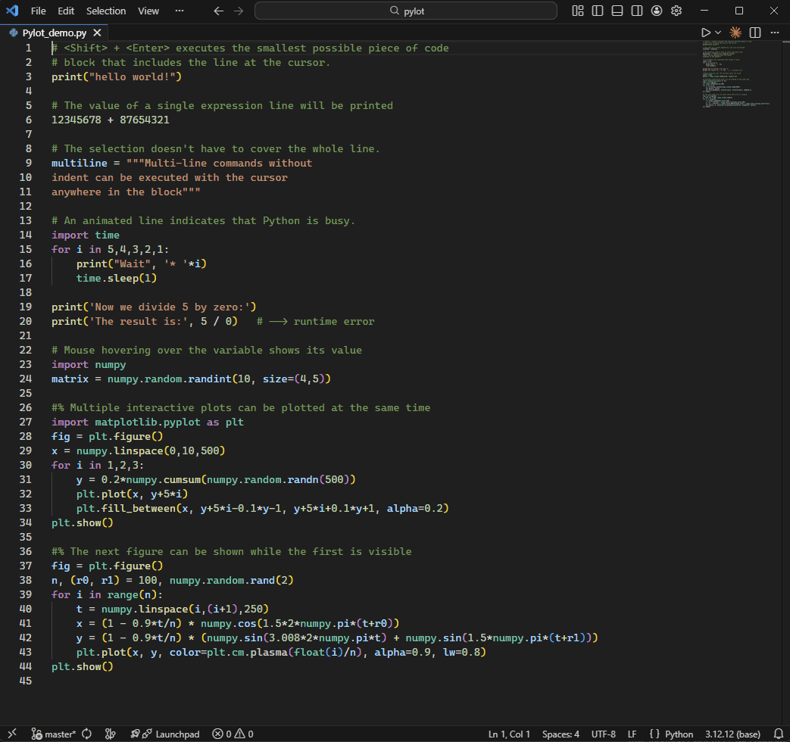

# Pylot - Python code runner

A VSCode extension that runs lines of Python code with visualized smart selection. In this interactive Python environment, commands are entered directly in the editor itself — not copied to the terminal — so the editor acts as the input interface, while outputs appear below in the output panel. By this approach the interactive session can be stored in the Python file and reproduced or finalized as a Python script.

## Features

- **Execute Selected Python** - Run smart selected code in a persistent Python REPL
- **Persistent REPL** - Maintains state and variables between executions
- **Visual Line Markers** - See execution status with gutter icons:
  - 🟧 Orange (animated): Currently running
  - 🟩 Greem: Successfully executed
  - 🟥 Red: Error occurred
- **Clean Output Window** - Output is displayed in a dedicated panel, without repeating the code lines.
- **Restart REPL** - Clear and restart the Python REPL session
- **Clear Output** - Clear the output channel
- **Evaluate Expression** - Quick evaluation of selected Python expressions
- **Matplotlib Event Handler** - Keeps Matplotlib plot windows open and allows multiple interactive figures to remain visible while doing further analysis

 

## Requirements

- [Python extension](https://marketplace.visualstudio.com/items?itemName=ms-python.python) (ms-python.python) - Required for Python interpreter detection

## Usage

### Execute Selected Code

1. Select Python code in your editor
2. Press `Shift+Enter` to execute
3. Results appear in the "pylot" output channel

### Commands

| Command | Action | Default Shortcut |
|---------|--------|------------------|
| Execute Selected Python | Run selected code | `Shift+Enter` |
| Execute Selected Python (No Cursor Move) | Run selected code without moving cursor | `Shift+Ctrl+Enter` |
| Restart Python REPL | Restart the REPL session | - |
| Clear Python Output | Clear the output channel | `Ctrl+Shift+C` |
| Remove All Color Marks | Remove all gutter markers | - |
| Evaluate Python Expression | Quick evaluate expression | `Ctrl+Alt+Space` |

### Keyboard Shortcuts

- `Shift+Enter` - Execute selected Python code
- `Shift+Ctrl+Enter` - Execute selected Python code without moving cursor
- `Ctrl+Shift+C` - Clear output (when Python file is focused)
- `Ctrl+Alt+Space` - Evaluate selected expression

## Extension Settings

This extension has no configurable settings. It uses the Python interpreter selected in the Python extension.

## Installation

1. Open VS Code
2. Go to Extensions (`Ctrl+Shift+X`)
3. Search for "Pylot"
4. Click Install
5. Open command palette (`Ctrl+Shift+P`)
6. Search for "Preferences: Open Keyboard Shortcuts"
7. Remove `Shift+Enter` and `Ctrl+Shift+Enter` from other Python extensions.

## License

MIT

## Author

[bitagoras](https://github.com/bitagoras)
