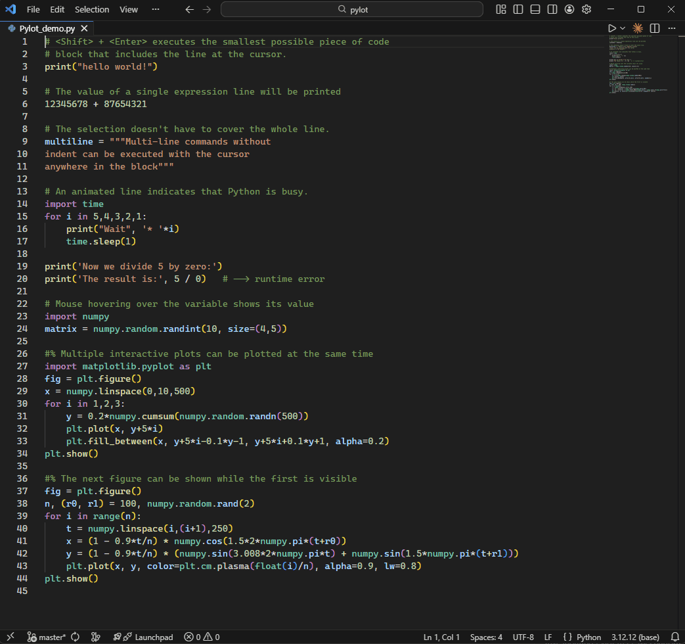

# Pylot – Python code runner
A VS Code extension that runs Python code directly from the editor using smart selection and visual line markers.

It unifies a Python REPL with the editor in a clean, minimalist way, bringing your source code to life as a lightweight and flexible alternative to  notebooks for data science.

## Features

- **Execute Python code** – Run selected code (or the current block) with `Shift+Enter` in a persistent Python REPL.
- **Clean output window** – Output is displayed in a dedicated panel, without repeating the code lines.
- **Visual line markers** – Line markers show smart selection and execution state:
  - 🟧 Orange (animated): currently running
  - 🟩 Green: successfully executed
  - 🟥 Red: error occurred
- **Variable inspection** – Hover over any variable to see its type and current value in a tooltip, even while other code is running. Additionally, it shows the length of container objects and the shape of NumPy arrays.
- **Expression evaluation** – Pressing `Ctrl+Shift+Space` evaluates any selected expression or variable at the cursor and shows the result in a tooltip.
- **Execution interruption** – Easily interrupt long-running or stuck code using `Ctrl+Alt+C` without losing your REPL state.
- **Matplotlib support** – Keeps multiple Matplotlib plot windows open and interactive while you continue working.

 

## Requirements

- [Python extension](https://marketplace.visualstudio.com/items?itemName=ms-python.python) (`ms-python.python`) – installed automatically as a dependency.

## Usage

### Execute Selected Code

1. Place your cursor on a line or select a block of Python code.
2. Press `Shift+Enter` to execute.
3. Results appear in the **pylot** output channel.

The extension uses the language server's smart selection to automatically expand your cursor to the enclosing top-level statement or block (function, class, etc.), so you rarely need to manually select code.

### Inspect Variables

Hover over any variable in your code after it has been executed. A tooltip will display:
- **Type** of the value (e.g., `str`, `int`, `ndarray`)
- **Length** for sized objects (lists, dicts, strings, etc.)
- **Shape** for NumPy arrays and tensors (e.g., `4 × 5`)
- The **value** itself in its text representation

### Evaluate Expressions

1. Select an expression (e.g., `a + b`, `data.mean()`) or place your cursor on a variable.
2. Press `Ctrl+Shift+Space`.
3. The result appears in a tooltip with type, length/shape, and value.

### Commands

| Command | Action | Default Shortcut |
|---------|--------|------------------|
| Execute Selected Python | Run selected code and advance cursor | `Shift+Enter` |
| Execute Selected Python (No Cursor Move) | Run selected code, keep cursor in place | `Shift+Ctrl+Enter` |
| Restart Python REPL | Restart the REPL session | – |
| Clear Python Output | Clear the output channel | `Ctrl+Shift+C` |
| Remove All Color Marks | Remove all gutter markers | – |
| Evaluate Python Expression | Evaluate expression or variable and show tooltip | `Ctrl+Shift+Space` |
| Interrupt Execution | Interrupt running code (sends KeyboardInterrupt) | `Shift+Escape` |

## Extension Settings

* `pylot.matplotlibEventHandler` – Controls when the Matplotlib non-blocking event handler is injected into the REPL.
  * `auto` (default) – Detects the `matplotlib` keyword in the code and loads the event handler before execution.
  * `always` – Loads the event handler on REPL startup.
  * `never` – Disables the custom event handler entirely.

## Installation

1. Open **Extensions** in VS Code (`Ctrl+Shift+X`).
2. Search for **Pylot** and click **Install**.
3. The required Python extension (`ms-python.python`) will be installed automatically.
4. If other Python extensions have claimed `Shift+Enter` or `Ctrl+Shift+Enter`, you may need to remove those bindings:
   - Open the command palette (`Ctrl+Shift+P`) → **Preferences: Open Keyboard Shortcuts**.
   - Search for the conflicting shortcut and remove or reassign it.

## License

MIT

## Author

[bitagoras](https://github.com/bitagoras)
