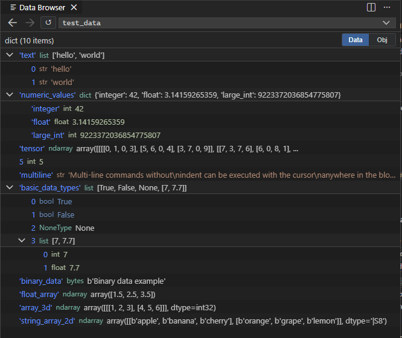
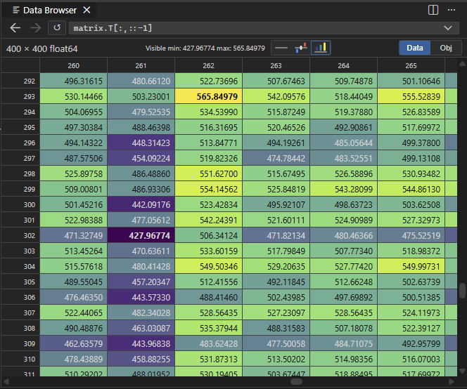

# Pylot – Python code runner
Run Python code directly from the editor with smart selection and visual line markers. This turns the editor into an interactive Python session, where you can write, run and evaluate Python code simultaneously in one place. Use it as a lightweight, flexible alternative to data science notebooks for experimenting with your data and piloting your algorithm.

## Features

- **Execute Python code** – Run selected code or the current line with `Shift+Enter` and advance the cursor.
- **Smart selection** – Selection will be expanded to execute only full valid Python statements.
- **Visual line markers** – Line markers show the selection and execution state:
  - 🟧 Orange (animated): currently running
  - 🟩 Green: successfully executed
  - 🟥 Red: error occurred
- **Pure output window** – Output is displayed in a dedicated panel, without repeating the code.
- **Run all** – Run the entire file with `Shift+Ctrl+Alt+Enter`
- **Cell execution** – `Shift+Enter` at a cell comment, which starts with `#%`, executes the entire cell until the next cell comment or the end of the file.
- **Variable inspection** – Hover over any variable to see its type and current value in a tooltip, even while the code is running. It also shows the length of sized objects and the shape of NumPy arrays.
- **Expression evaluation** – Pressing `Shift+Tab` evaluates any selected expression or variable at the cursor and shows the result in a tooltip.
- **Data browser** – Inspect any Python variable in a dedicated panel: a grid view for arrays, matrices, and data frames with buffered scrolling, color mapping, and inline editing; a tree view for objects, dicts, and lists. Accepts arbitrary Python expressions and slice notation in the expression field.
- **Variable Overlay** – See variable values and expression results by inlay hints directly in the editor, as ghost text right after the line.
- **For-Loop Progress Bars** – Automatically shows progress bars for long-running `for` loops directly in the editor: `[■■■■■■■■‑‑‑‑‑‑‑‑‑‑‑‑‑] 32%, i=4`.
- **Live Watches** – Add `#?` at the end of an assignment or expression line to show live inlay updates for that line while it executes.
- **Execution interruption** – Easily interrupt long-running or stuck code using `Ctrl+Alt+C` without losing your Python state.
- **Matplotlib support** – Keeps multiple Matplotlib plot windows open and interactive while you continue working.
- **AI agent integration** – Expose the Python REPL to AI coding agents via a built-in MCP server.
- **Editor toolbar buttons** – Three run buttons appear in the top-right editor toolbar: ▶ (run, keep cursor), ▶| (run and advance cursor), ▶▶ (run whole file).

 

### Commands

| Command | Action | Default Shortcut |
|---------|--------|------------------|
| Execute Selected Python | Run selected code and advance cursor | `Shift+Enter` |
| Execute Selected Python (No Cursor Move) | Run selected code, keep cursor in place | `Shift+Ctrl+Enter` |
| Execute Whole Python Program | Run the entire current file | `Shift+Ctrl+Alt+Enter` |
| Restart Python | Restart the Python session (REPL) | – |
| Clear Python Output | Clear the output channel | `Ctrl+Shift+C` |
| Hide Active Line Markers | Hide currently active line markers | – |
| Evaluate Python Expression | Evaluate expression or variable and show tooltip | `Shift+Tab` |
| Interrupt Execution | Interrupt running code (sends KeyboardInterrupt) | `Ctrl+Alt+C` |
| Toggle Inlay Hints | Enable or disable live variable overlays | – |
| Clear Inlay Hints | Remove all current variable hints from the editor | – |
| Open Data Browser | Open the data browser for the selected expression | `Ctrl+Shift+Space` |
| Open Object Browser | Open the object browser for the selected expression | – |
| Show Global Variables | Open the object browser to show all global variables | – |

### Open the Data Browser

The data browser offers dedicated views for exploring your data variables: a grid view for arrays, tensors, matrices, and data frames, and a tree view for dictionaries, lists, and objects.

1. Hover a variable or expression to open the tooltip.
2. Click the `Show data` or `obj` link in the tooltip.
3. In the viewer, use the expression field to enter any valid Python expression (for example, `matrix-10`, `matrix[:, ::-1]`, `matrix.T`, or `data["keys"]`).

 

 

## When to use Pylot

**Pylot** allows a unified workflow when different other options feel restrictive:
* **Use Jupyter?** → *It binds my code to a cell-based format.*
* **Use a Python console?** → *I can't store my session as a script.*
* **Write a complete script?** → *My decisions on the algorithm may depend on the processed data.*
* **And then just run it?** → *I can't check the internal state*
* **Use a debugger?** → *I can't improve my code during debugging.*

**Use Pylot!** → Gives you full interactive control over your code in the global scope (i.e. outside functions).

## Configuration

Pylot provides the following settings to customize its behavior:

- `pylot.replWorkingDirectory`: Ordered list of candidate working directories for the Python session. Each entry is tried from left to right; the first one that resolves to an existing directory is used. Supports VS Code variables: `${fileDirname}` (directory of the active file), `${workspaceFolder}`, `${userHome}`, and absolute paths. Default: `["${fileDirname}", "${workspaceFolder}", "${userHome}"]`.
- `pylot.matplotlibEventHandler`: Controls when the Matplotlib non-blocking event handler is injected into the Python session (default: `auto`).
- `pylot.executionMarkerStyle`: Configures the visual style of execution state markers. Options are `gutter`, `border` or `off` (default: `gutter`).
- `pylot.debug.python`: Enables detailed debug output for the Python session.
- `pylot.debug.mcpServer`: Enables detailed debug output for the internal MCP server.
- `pylot.mcpServer.enabled`: Start an internal MCP server so AI coding assistants (e.g. Kilocode, Continue) can call Pylot tools directly via the SSE (Server-Sent Events) transport.
- `pylot.mcpServer.port`: Port for the MCP server (default: `7822`).
- `pylot.enableInlayHints`: Globally toggle the live variable inlay hints (default: `true`).
- `pylot.enableForLoopLiveUpdates`: Controls the timer-based `for` loop instrumentation used for live progress bars and in-loop variable updates. Disabling it keeps the normal post-execution inlay hints (default: `true`).
- `pylot.enableWatchComments`: Enables implicit live watches for lines ending with `#?`. Disabling this setting makes Pylot ignore all `#?` markers (default: `true`).
- `pylot.maxInlayHintLength`: Maximum characters for an inlay hint before it is truncated (default: `50`).
- `pylot.inlayHintColor`: Custom color for the variable overlay in hex format.
- `pylot.showEditorTitleButtons`: Show or hide the ▶, ▶| and ▶▶ run buttons in the editor toolbar for Python files (default: `true`). Individual buttons can be hidden per VS Code's built-in right-click menu.

## Requirements

- [Python extension](https://marketplace.visualstudio.com/items?itemName=ms-python.python) (`ms-python.python`) – installed automatically as a dependency.

## Installation

1. Open **Extensions** in VS Code (`Ctrl+Shift+X`).
2. Search for **Pylot** and click **Install**.
3. The required Python extension (`ms-python.python`) will be installed automatically.
4. In case other Python extensions have claimed `Shift+Enter`, `Ctrl+Shift+Enter` or `Shift+Ctrl+Alt+Enter` in precedence, you need to remove those bindings:
   - Open the command palette (`Ctrl+Shift+P`) → **Preferences: Open Keyboard Shortcuts**.
   - Search for the conflicting shortcut and remove or reassign it.

## AI Agent Integration

Pylot includes an internal MCP (Model Context Protocol) server that lets AI coding assistants control the Python REPL without any external dependencies.

### Available MCP Tools

| Tool | Description |
|---|---|
| `pylot_append_and_execute` | Append Python code to the editor and run it in the REPL |
| `pylot_execute_range` | Re-execute a line range already in the editor (0-indexed) |
| `pylot_get_status` | Check if the REPL is ready and whether it is currently running |
| `pylot_evaluate_expression` | Evaluate a Python expression without modifying the document |
| `pylot_get_output` | Retrieve stdout/stderr from the most recent execution |
| `pylot_read_file` | Read active editor's content (with optional line numbers) |
| `pylot_edit_code` | Precise search-and-replace in the active editor |
| `pylot_restart_repl` | Clear the REPL memory and restart the session |
| `pylot_interrupt_execution` | Manually stop a long-running execution (KeyboardInterrupt) |

### Setup

1. Enable the MCP server in VS Code settings (`pylot.mcpServer.enabled`).
2. Connect your AI assistant via the **SSE (Server-Sent Events) transport** using this URL:
   `http://localhost:7822/sse`

## License

MIT

## Author

[bitagoras](https://github.com/bitagoras), 100% AI-assisted development (Gemini and Claude models)
